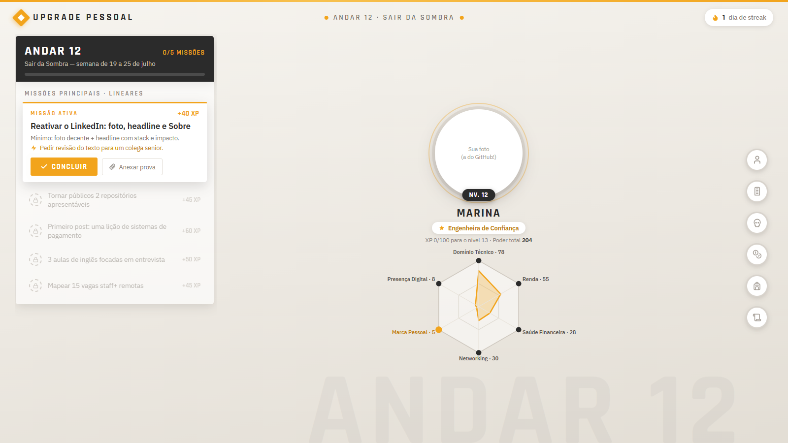
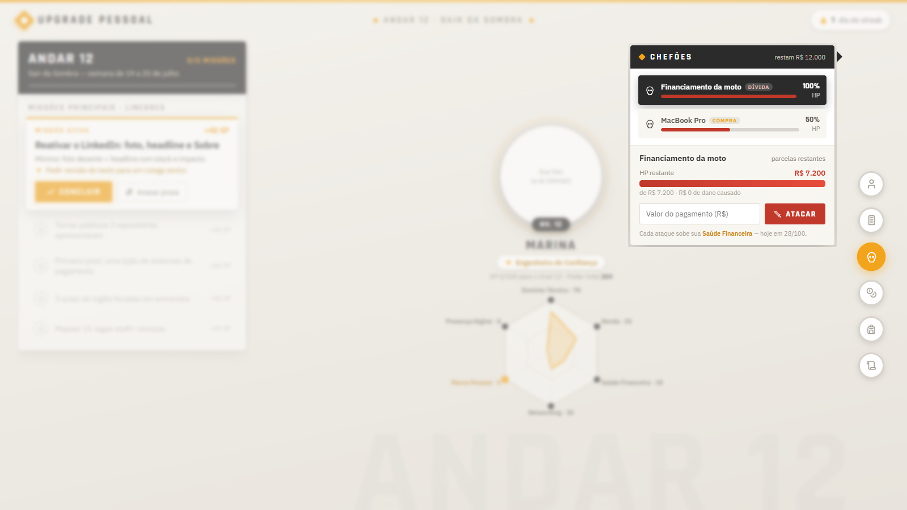
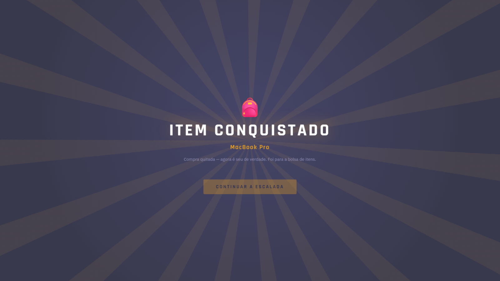
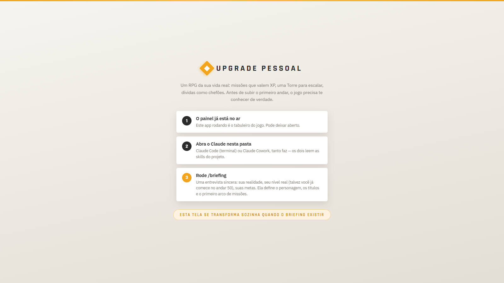

# Upgrade Pessoal

**Um RPG da vida real, com um mestre de jogo de IA.** Missões concretas de carreira e
finanças valem XP; cada nível é um andar de uma Torre a escalar (sim, inspirado em
*Sword Art Online*); dívidas são chefões com HP; compras quitadas viram itens no
inventário — e quem entrevista, calibra e avalia você é o Claude, rodando localmente
como *game master*.



> Instalação e uso: **[docs/SETUP.md](docs/SETUP.md)** · Todos os prints usam dados fictícios.

---

## A dor

Planos de mudança de vida — "vou melhorar de emprego", "vou sair das dívidas" —
morrem de três mortes conhecidas:

1. **O to-do list não tem memória.** Você risca a tarefa e ela desaparece. Semanas de
   esforço não se acumulam em lugar nenhum; a sensação de progresso zera toda segunda-feira.
2. **A sobrecarga paralisa.** O plano completo tem 40 passos, e olhar para os 40 de uma
   vez é o jeito mais rápido de não dar nenhum.
3. **Ninguém confere.** Sem revisão externa, tudo "conta": a tarefa feita pela metade,
   a semana que escorregou. A autoavaliação complacente corrói o plano por dentro.

Apps de hábito atacam o problema 1 com streaks; apps de produtividade atacam o 2 com
priorização. **Quase nada ataca o 3** — porque avaliação exige julgamento, e julgamento
não cabe num formulário.

## A resposta

### 1. Progresso vira personagem

O avanço não é uma lista riscada — é um personagem que **acumula**: XP, nível, seis
atributos num radar (Domínio Técnico, Renda, Saúde Financeira, Networking, Presença
Digital, Marca Pessoal), títulos e andares de uma Torre sem teto. O trabalho de três
meses atrás continua visível no seu poder de hoje. A filosofia de combate à sobrecarga
está na interface: **uma missão ativa por vez** — as próximas ficam trancadas.

As finanças entram na mesma linguagem: cada dívida é um **chefão** cujo HP é o valor
restante — registrar um pagamento é atacar. Uma compra parcelada também é um chefão,
mas com recompensa: quitou, ela vira **item na bolsa**, de dívida a conquista. A
reserva de emergência é a **bolsa de ouro** — um número que você atualiza quando quiser
(não é um app de finanças, de propósito) e que alimenta o atributo Saúde Financeira.




### 2. Um mestre de jogo que julga de verdade

Aqui entra a decisão de arquitetura central do projeto. Perguntas de onboarding são
dinâmicas demais para um formulário, e avaliação honesta é subjetiva demais para um
`if`. Então o app **não tenta fazer nada disso** — ele delega para um LLM que o
usuário já tem: o Claude (Code ou Cowork) aberto na pasta do projeto, guiado por duas
skills versionadas no repositório:

- **`/briefing`** — entrevista adaptativa inicial. Avalia o jogador **como um tech
  lead avaliaria**: o andar inicial é avaliativo (dá para começar no andar 50, se a
  senioridade real justificar), os atributos saem calibrados com justificativa, a
  escada de títulos é gerada personalizada, e o primeiro arco de missões nasce do que
  foi conversado — incluindo cursos e estudos quando a lacuna é real. Tudo é gravado
  num briefing versionado que passa a **governar todas as semanas seguintes**.
- **`/fechar-arco`** — o ritual de domingo. O Claude lê as missões da semana, **abre
  as provas anexadas** (prints, PDFs), dá 1 a 5 estrelas por entrega com justificativa
  — sem prova quando cabia prova, teto de 3 — fecha o arco (estrelas viram bônus de
  XP), atualiza o estado do mundo e planeja o próximo andar com base no briefing.

A honestidade da integração importa: o painel web **não chama** nenhuma API de IA
(sem chave, sem custo por request, sem chat embutido). É o agente que opera o painel
pela API local. O app é o tabuleiro; o Claude é o mestre. Cada um faz o que faz bem.



### 3. O ciclo completo

```
/briefing ──► semana: uma missão por vez ──► provas anexadas ──► /fechar-arco
   ▲          (painel, segundos por dia)     (o lastro da nota)   estrelas → XP
   │                                                                   │
   └────────────── briefing revisado quando a vida muda ◄──────────────┘
```

O painel detecta os momentos de transição e instrui: banco vazio mostra o onboarding;
semana 100% concluída mostra "andar limpo — rode `/fechar-arco`". E celebra os
eventos que merecem: level-up e chefão derrotado param a tela.

## Decisões de design que valem menção

- **Zero dados fixos.** O banco nasce vazio; não existe seed de conteúdo. Toda
  informação — nome, andar, metas, missões, títulos — nasce da entrevista. O app é
  genérico; o briefing o torna pessoal.
- **Não é um sistema financeiro.** Salário é informativo, a bolsa de ouro é manual,
  nada se reconcilia com banco. A única mágica permitida é converter números em
  mecânica de jogo (HP, atributo). Menos superfície, zero tentação de virar planilha.
- **A avaliação é externa por design.** O usuário não dá estrelas em si mesmo pela
  UI — o fechamento só existe via skill. É a resposta estrutural à dor nº 3.
- **Provas são cidadãs de primeira classe.** Anexos por missão, contados na interface,
  exigidos na avaliação. O domingo discute fatos, não lembranças.
- **Local-first radical.** SQLite + uploads numa pasta `data/`; backup é copiar a
  pasta. Sem conta, sem nuvem, sem telemetria.

## Stack

| Camada | Tecnologia |
|---|---|
| API | Node 20 · TypeScript · Express · Prisma · SQLite |
| Painel | React 18 · Vite · TypeScript (CSS artesanal, sem framework de UI) |
| Empacotamento | Docker — um container serve API + painel em `localhost:4000` |
| Mestre de jogo | Claude Code / Cowork + skills em `.claude/skills/` |

Detalhes de arquitetura, rotas da API e desenvolvimento: [docs/SETUP.md](docs/SETUP.md).

## Rodar em 4 linhas

```bash
git clone <repo> && cd upgrade-pessoal
docker compose up -d          # painel em http://localhost:4000
claude                        # Claude Code na pasta do projeto
> /briefing                   # a entrevista que cria o seu jogo
```

Passo a passo completo (Windows, atalho de desktop, desenvolvimento local, backup):
**[docs/SETUP.md](docs/SETUP.md)**.
